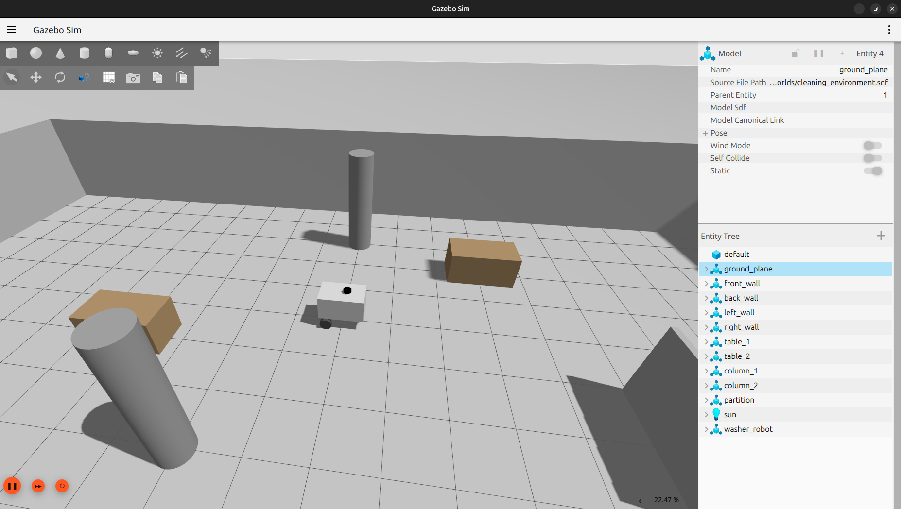
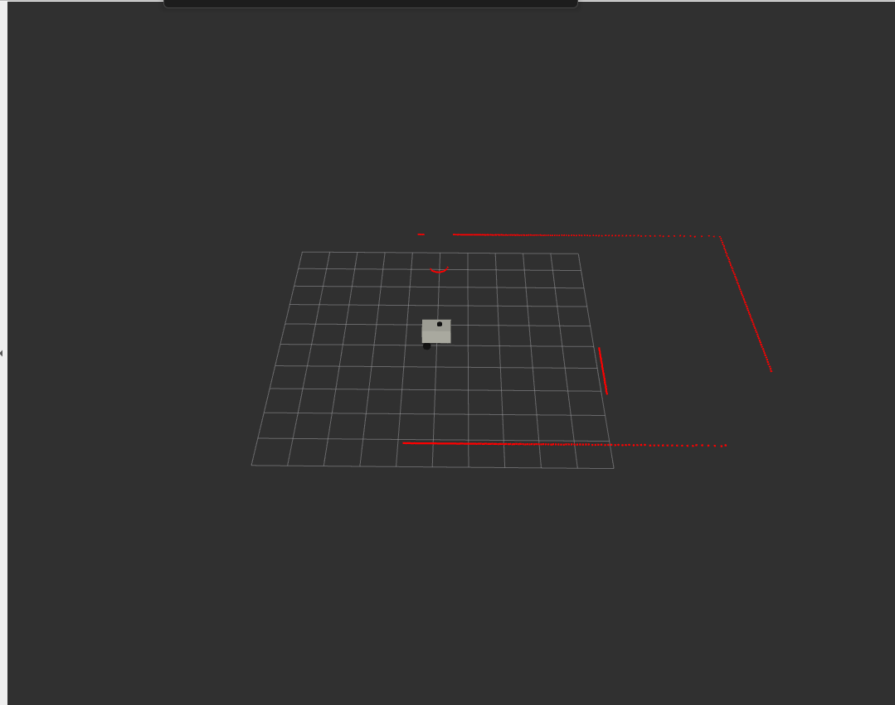

# ROS 2 Washer Robot


Симулятор мобильного робота-мойщика пола на базе ROS 2. Проект демонстрирует полный базовый цикл робототехнической разработки: описание робота в URDF, запуск физической симуляции в Gazebo Harmonic, управление с клавиатуры, публикацию одометрии и данных лидара, а также визуализацию модели и TF-дерева в RViz2.

Цель проекта — создать воспроизводимую основу для дальнейшего развития автономной навигации: SLAM, построения карты и планирования маршрутов с Nav2.

## Демонстрация






## Возможности

- физическая симуляция робота-мойщика в Gazebo Harmonic;
- параметрическое описание робота в URDF/Xacro;
- управление движением с клавиатуры клавишами `W`, `A`, `S`, `D`;
- публикация команд скорости через `/cmd_vel`;
- получение одометрии через `/odom`;
- получение данных лидара через `/scan`;
- публикация и визуализация TF-дерева через `/tf` и `/tf_static`;
- отдельный launch-файл для просмотра URDF в RViz2 без Gazebo.

## Архитектура проекта

| Пакет | Назначение |
| --- | --- |
| `washer_description` | URDF/Xacro-модель робота и конфигурация RViz2 |
| `washer_gazebo` | Мир Gazebo, спавн робота и `ros_gz_bridge` |
| `washer_teleop` | Управление роботом с клавиатуры |

## Стек

- **ОС:** Ubuntu 24.04
- **Middleware:** ROS 2 Jazzy
- **Симуляция:** Gazebo Harmonic
- **Визуализация:** RViz2
- **Описание робота:** URDF/Xacro
- **Языки:** Python, C++

## Текущий статус и Roadmap

### Реализовано

- базовая симуляция мобильного робота в Gazebo Harmonic;
- описание робота и сенсоров в URDF/Xacro;
- управление с клавиатуры;
- обмен данными между Gazebo и ROS 2 через `ros_gz_bridge`;
- публикация `/cmd_vel`, `/odom`, `/scan`, `/tf` и `/tf_static`;
- просмотр модели и состояния робота в RViz2.

### В планах

- интеграция SLAM Toolbox для построения карты помещения;
- подключение Nav2 для автономной навигации и планирования маршрута;
- сохранение карты и логирование траектории движения;
- подготовка Dockerfile и Dev Container для воспроизводимого окружения;
- добавление интеграционных тестов и автоматической проверки сборки.

## Требования

- Ubuntu 24.04;
- ROS 2 Jazzy;
- Gazebo Harmonic;
- локальный графический сеанс Ubuntu для запуска Gazebo и RViz2.

## Установка

### 1. Установка ROS 2 Jazzy

Если ROS 2 Jazzy еще не установлен, следуйте [официальной инструкции для Ubuntu 24.04](https://docs.ros.org/en/jazzy/Installation/Ubuntu-Install-Debs.html).

После установки проверьте, что ROS доступен:

```bash
source /opt/ros/jazzy/setup.bash
ros2 --version
```

### 2. Установка зависимостей проекта

```bash
sudo apt update
sudo apt install -y \
  ros-jazzy-ros-gz \
  ros-jazzy-rviz2 \
  ros-jazzy-robot-state-publisher \
  ros-jazzy-joint-state-publisher \
  ros-jazzy-xacro \
  python3-colcon-common-extensions
```

Gazebo Harmonic устанавливается вместе с пакетом `ros-jazzy-ros-gz`. Проверить его можно командой:

```bash
gz sim --version
```

### 3. Клонирование и сборка workspace

```bash
cd ~
git clone https://github.com/VladimirSkiba/ros2_washer_robot.git
cd ~/ros2_washer_robot

source /opt/ros/jazzy/setup.bash
rosdep update
rosdep install --from-paths src --ignore-src -r -y
colcon build --symlink-install
source install/setup.bash
```

Если проект уже скачан, достаточно перейти в его каталог и выполнить сборку:

```bash
cd ~/ros2_washer_robot
source /opt/ros/jazzy/setup.bash
colcon build --symlink-install
source install/setup.bash
```

После изменения `package.xml`, `CMakeLists.txt` или URDF повторяйте `colcon build --symlink-install`.

## Запуск симуляции

Окна Gazebo и RViz2 могут не открываться из встроенного терминала VS Code. Для запуска используйте обычный терминал Ubuntu. Для удобной работы в нескольких терминалах можно установить Terminator:

```bash
sudo apt install terminator
```

### Горячие клавиши Terminator

| Сочетание | Действие |
| --- | --- |
| `Ctrl+Shift+O` | Разделить окно по горизонтали |
| `Ctrl+Shift+E` | Разделить окно по вертикали |
| `Alt+Стрелки` | Переключиться между областями |


### все запущенные контейнеры и их id

```
docker ps
```

### Войти в контейнер по ID

``` 
docker exec -it <id_контейнера> bash
```

В каждом новом терминале сначала выполните:

```bash
cd ~/ros2_washer_robot
source /opt/ros/jazzy/setup.bash
source install/setup.bash
```

Или используйте готовый скрипт:

```bash
cd ~/ros2_washer_robot
source env.sh
```

Запустите процессы в отдельных терминалах.

### 1. Gazebo

```bash
ros2 launch washer_gazebo sim.launch.py
```

Должно открыться окно Gazebo с помещением и роботом. Не закрывайте этот терминал во время работы.

### 2. RViz2

```bash
rviz2 -d ~/ros2_washer_robot/src/washer_description/rviz/lidar_vizion.rviz
```

Если RViz2 запущен без конфигурации, выберите `base_link` как `Fixed Frame` и добавьте `RobotModel` с источником `/robot_description`.

### 3. Управление с клавиатуры

```bash
ros2 run washer_teleop keyboard_control.py
```

| Клавиша | Действие |
| --- | --- |
| `W` | Движение вперед |
| `S` | Движение назад |
| `A` | Поворот влево |
| `D` | Поворот вправо |
| `Space` или `K` | Остановка |
| `Ctrl+C` | Выход |

## Быстрая проверка

В отдельном терминале после запуска Gazebo можно проверить основные topics:

```bash
ros2 topic list
ros2 topic echo /odom --once
ros2 topic echo /scan --once
ros2 topic info /cmd_vel
```

Ожидаемые topics:

- `/cmd_vel` — команды скорости;
- `/odom` — одометрия робота;
- `/scan` — данные лидара;
- `/tf` и `/tf_static` — TF-дерево;
- `/robot_description` — URDF робота.

Для разовой проверки движения можно отправить команду вручную:

```bash
ros2 topic pub --once /cmd_vel geometry_msgs/msg/Twist \
  "{linear: {x: 0.3}, angular: {z: 0.0}}"
```

Остановить робота:

```bash
ros2 topic pub --once /cmd_vel geometry_msgs/msg/Twist '{}'
```

## Запуск только визуализации URDF

Если Gazebo не нужен, можно открыть модель робота в RViz2:

```bash
source /opt/ros/jazzy/setup.bash
source install/setup.bash
ros2 launch washer_description display.launch.py
```

Этот launch-файл запускает `robot_state_publisher`, `joint_state_publisher` и RViz2.

## Устранение неполадок

<details>
<summary>Команда ROS 2 не найдена</summary>

Подключите окружение ROS 2 и workspace:

```bash
source /opt/ros/jazzy/setup.bash
source ~/ros2_washer_robot/install/setup.bash
```

</details>

<details>
<summary>Пакет не найден после сборки</summary>

Перейдите в workspace, пересоберите проект и обновите окружение:

```bash
cd ~/ros2_washer_robot
source /opt/ros/jazzy/setup.bash
colcon build --symlink-install
source install/setup.bash
ros2 pkg list | grep washer
```

</details>

<details>
<summary>Робот не двигается</summary>

Убедитесь, что Gazebo запущен, а `keyboard_control.py` работает в отдельном терминале. Затем проверьте:

```bash
ros2 topic echo /cmd_vel
ros2 topic info /cmd_vel
```

</details>

<details>
<summary>Окна Gazebo или RViz2 не открываются</summary>

Запускайте графические приложения из обычного терминала Ubuntu, а не из встроенного терминала VS Code. Для работы нужен локальный графический сеанс Ubuntu или корректно настроенный X11/Wayland.

</details>

## Ограничения текущей версии

- Docker и Dev Container находятся в roadmap и не используются в текущем сценарии запуска;
- SLAM Toolbox, Nav2, сохранение карты и логирование траектории пока отсутствуют в исходном дереве;
- после пересборки необходимо заново выполнить `source install/setup.bash`.

## Лицензия

Лицензия проекта будет добавлена в отдельном обновлении.
